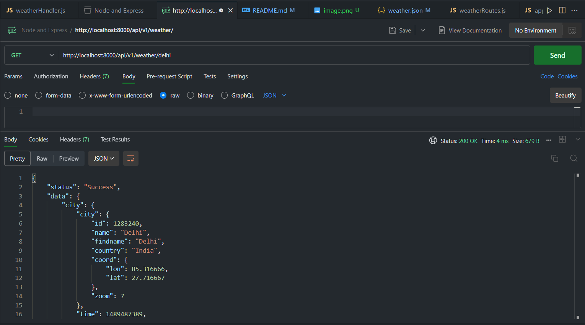

# ExpressJS-assignments

Use: npm start
## showAllDetails
GET http://localhost:8000/api/v1/weather/

## addCityWeather
POST http://localhost:8000/api/v1/weather/

## showRainDetails
GET http://localhost:8000/api/v1/weather/rain

## showDetailOfSpecificCity
GET http://localhost:8000/api/v1/weather/Delhi

## changeRainDetails 
PUT http://localhost:8000/api/v1/weather/Delhi

## removeCity
DELETE http://localhost:8000/api/v1/weather/Agra

